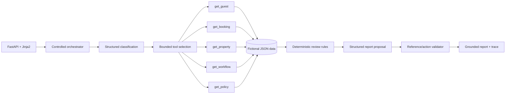

# StayFlow — Hotel Booking and Guest Operations Support

StayFlow is a focused agentic-assessment prototype for triaging hotel booking and guest-operations feedback. A narrow hospitality domain makes grounding easy to inspect: a support officer can compare every proposed action with fictional guest, booking, property, workflow, and policy records.

> This prototype uses a fictional hotel booking and operations domain. Its properties, guests, bookings, workflows, and policies do not represent any real organisation.

## Supported issues

`booking_issue`, `cancellation_request`, `refund_request`, `payment_issue`, `check_in_issue`, `room_issue`, `hotel_service_complaint`, `overbooking`, `guest_safety`, `data_privacy`, `accessibility_issue`, `feature_request`, `praise`, `abuse_policy`, and `other`.

Sentiment, urgency, business impact, confidence, and ambiguity remain separate. An angry towel complaint is not automatically critical; a calm report that a room door cannot lock is critical.

## Architecture



The model may classify, request read-only tools, and propose report content. Application code validates tool names/arguments, executes JSON retrieval, enforces category-specific context, validates source IDs and allowed recommendations, and makes the final human-review decision. See [DESIGN.md](DESIGN.md).

## Data and tools

- `guests.json` via `get_guest(guest_id?, guest_email?)`
- `bookings.json` via `get_booking(booking_id?, guest_id?)`
- `properties.json` via `get_property(property_id)`
- `workflows.json` via `get_workflow(category)`
- `policies.json` via `get_policy(category, property_country?, booking_channel?)`

Missing records are structured results. The model never reads files directly.

## Local setup

```bash
uv sync --python 3.12 --all-extras --locked
cp .env.example .env
uv run uvicorn app.main:app --reload
```

Open the UI at <http://localhost:8000>, Swagger at <http://localhost:8000/docs>, and health at <http://localhost:8000/health>. Demo identifiers include `GST-1001`, `BKG-2004`, and `HTL-LON-01`.

Mock mode needs no API key:

```dotenv
LLM_PROVIDER=mock
```

OpenAI mode uses the official SDK with Pydantic Structured Outputs and validated function calls:

```dotenv
LLM_PROVIDER=openai
OPENAI_API_KEY=your-server-side-key
OPENAI_MODEL=gpt-5.6
```

Automated tests force mock mode even when local `.env` enables OpenAI.

## UI and API example

The form accepts optional guest email/ID, booking ID, property ID, channel, and guest feedback. Shortcut buttons populate refund, overbooking, safety, ambiguous, missing-booking, and injection demonstrations.

```bash
curl -X POST http://localhost:8000/feedback/analyze \
  --data-urlencode 'feedback_text=The hotel cancelled my reservation last week, but I still have not received my refund.' \
  --data-urlencode 'guest_id=GST-1003' \
  --data-urlencode 'booking_id=BKG-2005' \
  --data-urlencode 'property_id=HTL-BER-01' \
  --data-urlencode 'channel=email'
```

The route returns a rendered HTML report; Swagger documents its form contract.

For the same analysis as a structured `HotelFeedbackReport` plus trace:

```bash
curl -X POST http://localhost:8000/api/feedback/analyze \
  -H 'Content-Type: application/json' \
  -d @examples/refund_pending/input.json
```

The application generates `report_id`, `generated_at`, `report_status`, source reasons, action priority, and approval flags. They are not delegated to the model.

## Docker, tests, and evaluation

```bash
docker compose up -d --build
curl http://localhost:8000/health

uv run ruff check app tests evaluation
uv run mypy app evaluation
uv run pytest
LLM_PROVIDER=mock OPENAI_API_KEY='' uv run python -m evaluation.run
```

Eight reproducible hotel cases live in [evaluation/scenarios.json](evaluation/scenarios.json), with normalized outputs under `evaluation/outputs/`. They check categories, tool attempts, real fixture IDs, schema validity, review outcomes, missing context, unsupported claims, and trace completeness without exact prose matching.

Five assessment-ready sample bundles live under `examples/`. Refresh them deterministically with:

```bash
LLM_PROVIDER=mock OPENAI_API_KEY='' uv run python -m examples.generate
```

Each folder contains `input.json`, `output.json`, and a short reproduction note. The saved output includes classification, tool calls, retrieved context, final structured report, and human-review decision.

For end-user steps see [USER_WORKFLOW.md](USER_WORKFLOW.md). For the protected Ubuntu/Caddy stack see [DEPLOYMENT.md](DEPLOYMENT.md).

## Limitations

- All people, properties, bookings, workflows, and policies are fictional local fixtures.
- Policy filtering accepts country/channel inputs but current small fixtures are category-scoped.
- Booking lookup by guest can return multiple records and marks that result ambiguous; it does not guess which stay is relevant.
- Contradiction detection is intentionally narrow and does not decide which source is correct.
- The HTML endpoint is not a separate JSON API.
- No authentication exists in development; production Compose adds Caddy Basic Auth and rate/body limits.
- No database, queue, vector search, autonomous hotel action, or persistent audit store is included.
