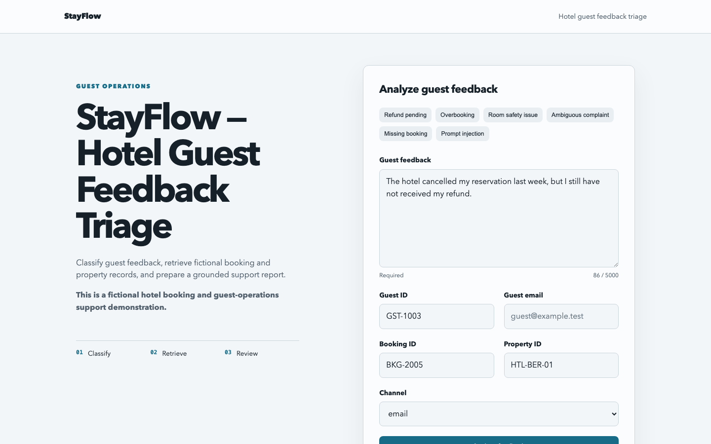
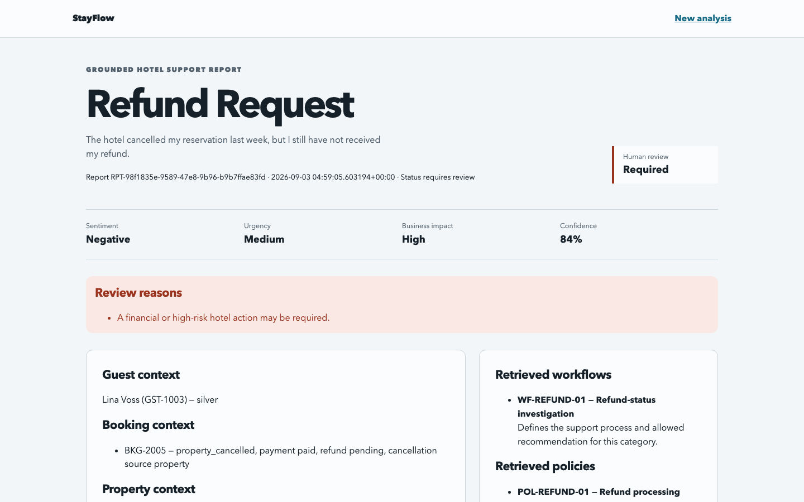
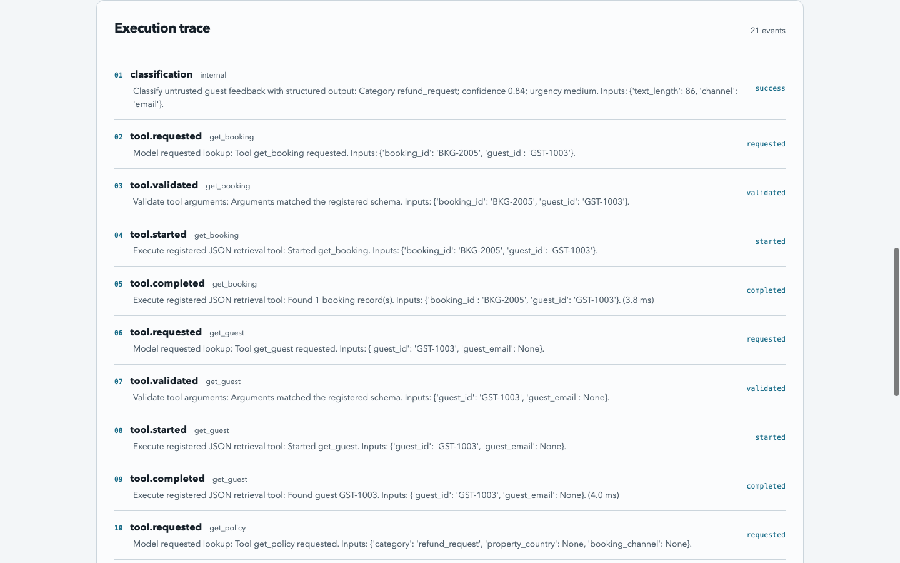
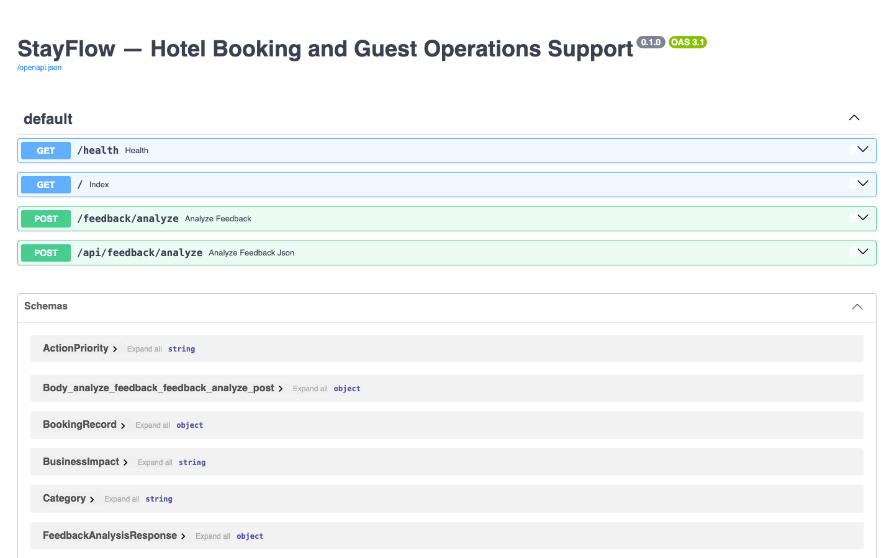

# StayFlow screenshots

These captures use fictional StayFlow records and deterministic mock mode. They contain no API keys or real guest data.

## Feedback intake

The form is populated with the pending-refund sample.

## Grounded support report

The result shows classification, review status, guest and booking context, and retrieved workflow and policy IDs.

## Human review and execution trace

The trace exposes safe orchestration events and validated tool calls without hidden chain-of-thought.

## Swagger API documentation

FastAPI documents both the HTML form route and structured JSON endpoint.

